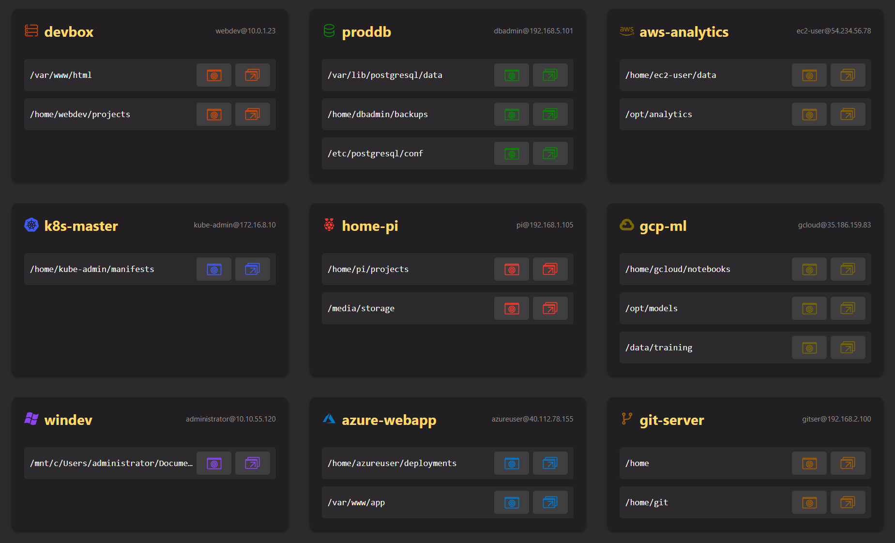
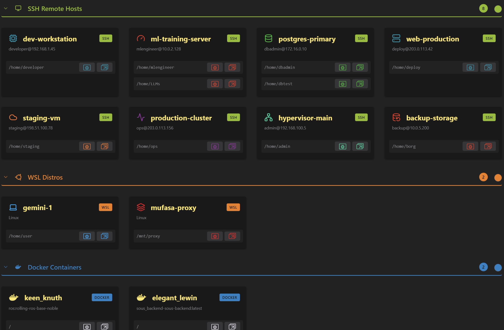
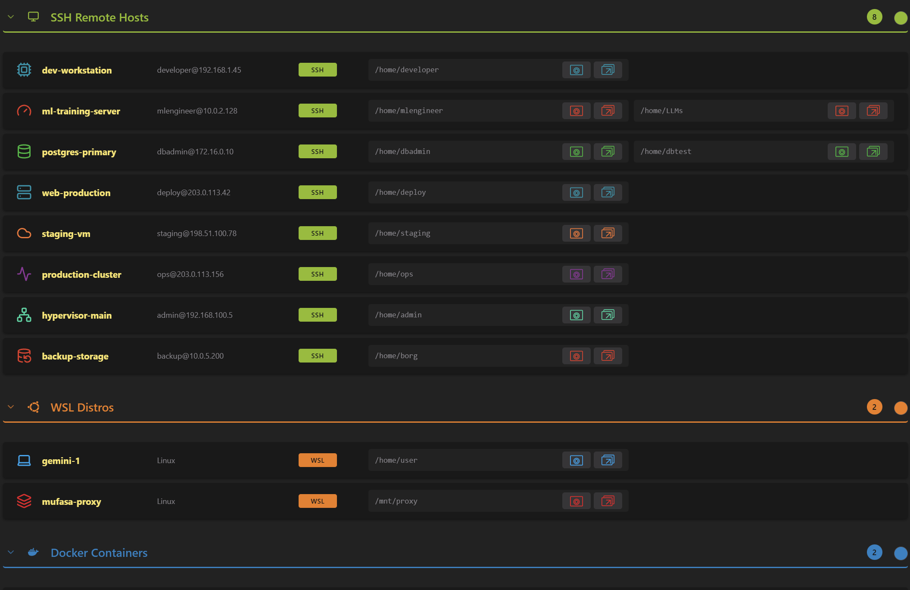
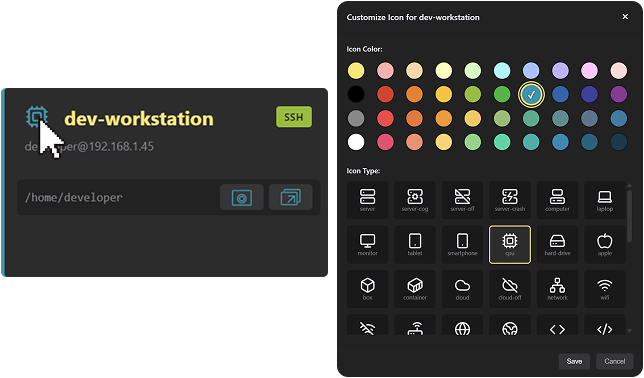
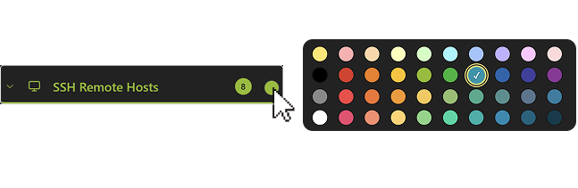

# DaSSHboard 🚀

Supercharge Your Remote Development Workflow with One-click access to your remote development machines and environments with a customizable VSCode panel.

DaSSHboard is a stylish, intuitive dashboard for VS Code-based IDEs that puts your remote development enviroments available at your fingetips, only one click away.

Access your <picture><source media="(prefers-color-scheme: dark)" srcset="media/hosts/server_white.svg"></picture> **SSH connections**, <picture><source media="(prefers-color-scheme: dark)" srcset="media/hosts/linux_white.svg"></picture> **WSL distros**, and <picture><source media="(prefers-color-scheme: dark)" srcset="media/hosts/docker_white.svg"></picture> **Running Docker containers** — all from one convenient dashboard. 

Never waste time hunting for host details again!

---

### 📦 Installation
Search for **`DaSSHboard`** in the Extensions panel (VS Code / Cursor) or on the **VS Code Marketplace**, on Open

You can also download the `.vsix` file from the [latest release](https://github.com/alberto-rota/DaSSHboard/releases/latest) or from **Open-VSX** and drag-and-drop it into the Extensions panel.

  
    <a href="https://marketplace.visualstudio.com/items?itemName=AlbertoRota.dasshboard">
      🔌 Install from Marketplace
    </a>
  
  |   
  
    <a href="https://github.com/alberto-rota/DaSSHboard/raw/master/dasshboard-latest.vsix">
      ⬇️ Download Latest Release (.vsix)  
    </a>
  
  |
  
    <a href="https://open-vsx.org/extension/AlbertoRota/dasshboard">
      📦 Visit OpenVSX
    </a>
  

---

## 🚀 Quick Start

1. **Install** the extension.  
2. Hit the **`DaSSHboard button`** (second from the left in the status-bar), use the Remote menu, *or* run **"Show DaSSHboard"** from the Command Palette.  
3. All your remote development environments are now one click away! 
4. Click the <picture><source media="(prefers-color-scheme: dark)" srcset="media/current-window-white.svg"></picture> (open in current window) or <picture><source media="(prefers-color-scheme: dark)" srcset="media/new-window-white.svg"></picture> (open in new window) button next to one of the available entrypoint paths on the remote host, and you'll jump straight into that environment!

**Notes:** 
- WSL support is available on Windows systems with the [WSL extension](https://marketplace.visualstudio.com/items?itemName=ms-vscode-remote.remote-wsl) installed. 
- Docker support is available if the [Container Tools extension](https://open-vsx.org/extension/ms-azuretools/vscode-containers) is installed. 
- ---

## 🛠️ Customization

DaSSHboard reads your existing SSH config (`~/.ssh/config`) to establish which remote SSH hosts you usually connect to, detects WSL distros automatically, and parses `docker ps` to establish which containers are running. 

Default entrypoint paths are chosen as follows:
- For SSH hosts: the home directory of the `User` specified in your `~/.ssh/config`.
- For WSL distros: the default user's home directory for that WSL installation.
- For Docker containers: the root folder (`/`) of the running container.
  
### 🗂️ Layouts
View your host in a grid layout or in a list layout! Change it with the toggle button at the bottom of the view

  

    
  

  

    
  

 

### 🎨 Customize each host’s icon and color for easy identification

  

    

      <b>Customize host icons</b> 
      Differentiate every host and make it immediately recognizable by assigning it its own color and one of the icons among a set of several from <a href="https://lucide.dev/icons/" target="_blank">Lucide</a>'s. 
        
      Click on the icon on the top left of th host card and you'll get a customization UI. The set of available icons gets updated frequently!
    

  

  

    
  

  

    

      <b>Assign section colors</b> 
      Assign a color to each section (SSH hosts, WSLs and Docker containers). 
    

  

  

    
  

**Configure folder paths:**  
You might have remote development environment into more than one folder in a single host. With **DaSSHboard**, all of them will still be one click away! Just click the **`Configure Path Entrypoints`** button at the bottom of the page and add as many entries as you want in the json.

---

## 🤝 Contributing  

Spotted a bug or have a feature idea?  
Open an issue or pull-request on **[GitHub](https://github.com/alberto-rota/DaSSHboard)** – contributions are very welcome!

---

## 📄 License  

**GPL v3**

Enjoy a smoother, more colourful remote-development experience with **DaSSHboard**! ✨
