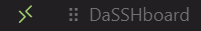

# DaSSHboard 🚀

[](https://marketplace.visualstudio.com/items?itemName=AlbertoRota.dasshboard)
[](https://marketplace.visualstudio.com/items?itemName=AlbertoRota.dasshboard)
[](https://marketplace.visualstudio.com/items?itemName=AlbertoRota.dasshboard)

## Supercharge Your Remote Development Workflow

DaSSHboard is a stylish, intuitive dashboard for VS Code that puts your SSH connections at your fingertips.  
Never waste time typing SSH commands or hunting for host details again!


---

### 📦 Installation
Search for **`DaSSHboard`** in the Extensions panel (VS Code / Cursor) or on the **VS Code Marketplace**.

You can also download the `.vsix` file and drag-and-drop it into the Extensions panel.

<div align="center">
  <span style="margin-right: 20px;">
    <a href="https://marketplace.visualstudio.com/items?itemName=AlbertoRota.dasshboard">
      🔌 Install from Marketplace
    </a>
  </span>
  or   
  <span style="margin-left: 20px;">
    <a href="https://github.com/alberto-rota/DaSSHboard/raw/master/dasshboard-latest.vsix">
      ⬇️ Download Latest Release (.vsix)
    </a>
  </span>
</div>


---

## ✨ Features

| &nbsp; | &nbsp; |
|--------|--------|
| **Smart Auto-discovery** | Detects every host in your `~/.ssh/config`. |
| **One-Click Connect** | Open any host / folder in the current or a new VS Code window. |
| **Status-Bar Shortcut** | A dedicated button sits **right after the Remote indicator**. Icon is user-configurable. |
| **Remote-Aware UI** | When you’re in a Remote-SSH window a red “Close Remote connection” button appears. |
| **Remote Menu Integration** | “Show DaSSHboard” is available in the Remote window menu (bottom-left) and the Command Palette. |
| **Beautiful Interface** | Per-host colours and icons – local SVGs **or** any *Codicon* (`codicon:cloud`, `$(server)`, …). |
| **Multiple Folders** | Define as many start-folders as you like for each host. |
| **Startup Integration** | Optionally pop the dashboard open when VS Code starts. |

---

## 🚀 Quick Start

1. **Install** the extension.  
2. Hit the **DaSSHboard button**  (second from the left in the status-bar),  
   use the Remote menu, *or* run **“Show DaSSHboard”** from the Command Palette.  
3. Click a host → choose the folder → you’re in!

---

## ⚙️ Configuration

DaSSHboard reads your existing SSH config (`~/.ssh/config`), so you never duplicate connection info.

Open **File ▸ Preferences ▸ Settings** and tweak:

```jsonc
{
  // open dashboard when VS Code starts
  "daSSHboard.openAtStartup": true,

  // choose any codicon for the status-bar button
  "daSSHboard.statusBarIcon": "dashboard",

  // per-host customisation
  "daSSHboard.hosts": {
    "my-server": {
      "folders": ["/home/user", "/var/www"],
      "color": "#2980b9",

      /* icon options:
         - local SVG in media/hosts/       → "server"
         - codicon name                    → "codicon:cloud"  or  "$(cloud)"
         - leave empty to use default      → ""               */
      "icon": "codicon:cloud"
    }
  }
}
```
### Using Codicons  

Want to use VS Code’s native icon set instead of local SVGs?  
Just set `icon` to either of the following syntaxes:

| Syntax | Example | Result |
|--------|---------|--------|
| `codicon:<name>` | `"codicon:cloud"` | fetches **cloud.svg** from the official repo |
| `$(<name>)` | `"$(database)"` | same as above (status-bar shorthand) |

DaSSHboard pulls the SVG directly from <https://github.com/microsoft/vscode-codicons/tree/main/src/icons>  
and recolours it to match your theme or custom host colour.

---

### Built-In SVG Icon Pack  

Prefer bundled assets?  A full set of light- & dark-aware SVGs lives in  
`media/hosts/`.  Use the filename **without** the “.svg” extension, e.g. `"server"`.

| | | | | | | |
|:---:|:---:|:---:|:---:|:---:|:---:|:---:|
| <picture><source media="(prefers-color-scheme: dark)" srcset="media/readme/analytics_white.png"></picture><br>analytics | <picture><source media="(prefers-color-scheme: dark)" srcset="media/readme/apple_white.png"></picture><br>apple | <picture><source media="(prefers-color-scheme: dark)" srcset="media/readme/aws_white.png"></picture><br>aws | <picture><source media="(prefers-color-scheme: dark)" srcset="media/readme/azure_white.png"></picture><br>azure | <picture><source media="(prefers-color-scheme: dark)" srcset="media/readme/backup_white.png"></picture><br>backup | <picture><source media="(prefers-color-scheme: dark)" srcset="media/readme/cicd_white.png"></picture><br>cicd | <picture><source media="(prefers-color-scheme: dark)" srcset="media/readme/code_white.png"></picture><br>code |
| <picture><source media="(prefers-color-scheme: dark)" srcset="media/readme/database_white.png"></picture><br>database | <picture><source media="(prefers-color-scheme: dark)" srcset="media/readme/desktop_white.png"></picture><br>desktop | <picture><source media="(prefers-color-scheme: dark)" srcset="media/readme/docker_white.png"></picture><br>docker | <picture><source media="(prefers-color-scheme: dark)" srcset="media/readme/files_white.png"></picture><br>files | <picture><source media="(prefers-color-scheme: dark)" srcset="media/readme/folder_white.png"></picture><br>folder | <picture><source media="(prefers-color-scheme: dark)" srcset="media/readme/git_white.png"></picture><br>git | <picture><source media="(prefers-color-scheme: dark)" srcset="media/readme/google_white.png"></picture><br>google |
| <picture><source media="(prefers-color-scheme: dark)" srcset="media/readme/home_white.png"></picture><br>home | <picture><source media="(prefers-color-scheme: dark)" srcset="media/readme/iot_white.png"></picture><br>iot | <picture><source media="(prefers-color-scheme: dark)" srcset="media/readme/kubernetes_white.png"></picture><br>kubernetes | <picture><source media="(prefers-color-scheme: dark)" srcset="media/readme/laptop_white.png"></picture><br>laptop | <picture><source media="(prefers-color-scheme: dark)" srcset="media/readme/linux_white.png"></picture><br>linux | <picture><source media="(prefers-color-scheme: dark)" srcset="media/readme/office_white.png"></picture><br>office | <picture><source media="(prefers-color-scheme: dark)" srcset="media/readme/proxy_white.png"></picture><br>proxy |
| <picture><source media="(prefers-color-scheme: dark)" srcset="media/readme/raspberry_white.png"></picture><br>raspberry | <picture><source media="(prefers-color-scheme: dark)" srcset="media/readme/security_white.png"></picture><br>security | <picture><source media="(prefers-color-scheme: dark)" srcset="media/readme/server_white.png"></picture><br>server | <picture><source media="(prefers-color-scheme: dark)" srcset="media/readme/test_white.png"></picture><br>test | <picture><source media="(prefers-color-scheme: dark)" srcset="media/readme/web_white.png"></picture><br>web | <picture><source media="(prefers-color-scheme: dark)" srcset="media/readme/windows_white.png"></picture><br>windows | <picture><source media="(prefers-color-scheme: dark)" srcset="media/readme/gcp_white.png"></picture><br>gcp |

---

## 🤝 Contributing  

Spotted a bug or have a feature idea?  
Open an issue or pull-request on **[GitHub](https://github.com/alberto-rota/DaSSHboard)** – contributions are very welcome!

---

## 📄 License  

**GPL v3**

Enjoy a smoother, more colourful remote-development experience with **DaSSHboard**! ✨
